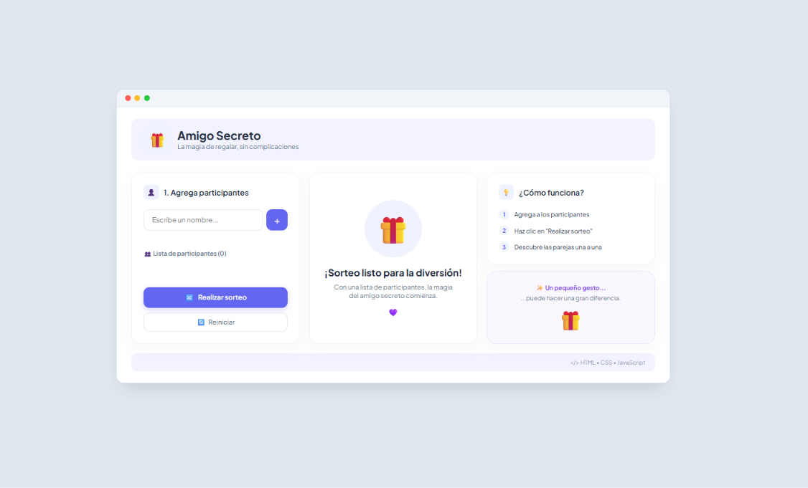
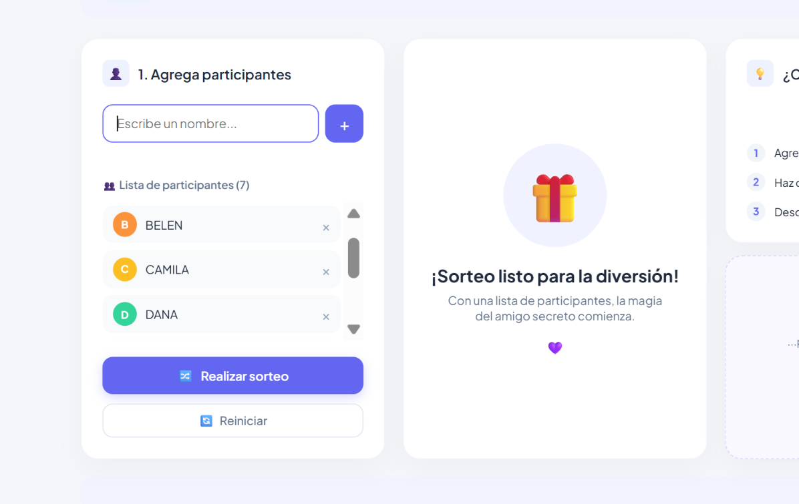
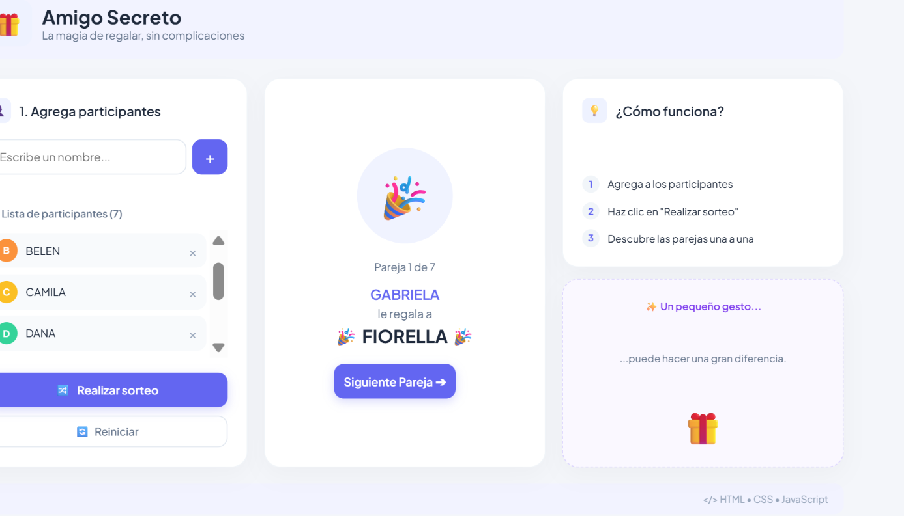

# 🎁 Amigo Secreto - Challenge Oracle ONE & Alura Latam

> Aplicación web interactiva desarrollada para la gestión y sorteo aleatorio de **Amigo Secreto**, construida con desarrollo web (HTML5, CSS3,JavaScript) dentro del marco de la ruta de formación **Oracle Next Education (ONE) + Alura Latam**.
---

## 🔗 Demo

Puedes acceder y probar la versión desplegada en tiempo real a través de GitHub Pages:
👉 **[Ver Aplicación Web - Amigo Secreto](https://jebareiro.github.io/amigo-secreto-ch-alura/)**

---

## 🚀 Funcionalidades Principales

* -- Gestión Dinámica de Participantes: Registro interactivo de nombres con generación automática de avatares dinámicos basados en iniciales y colores asignados.
* -- Sistema de Validaciones Robusto:
  * **Sanitización:** Previene entradas vacías o compuestas únicamente por espacios en blanco (`.trim()`).
  * **Duplicados:** Bloquea nombres duplicados ignorando mayúsculas y minúsculas.
  * **Formatos:** Impide el ingreso de cadenas puramente numéricas.
* -- Eliminación de Participantes: Posibilidad de quitar un nombre específico de la lista antes del sorteo sin reiniciar todo el flujo.
* --  Algoritmo de Sorteo Aleatorio:** Selección justa e imparcial del amigo secreto utilizando el motor de pseudo-aleatoriedad de JavaScript (`Math.random()`), requiriendo un mínimo de 2 participantes.
* -- Dashboard de 3 Columnas:** Diseño estructurado tipo panel interactivo con estados dinámicos (pantalla de bienvenida y banner de resultado).
* -- Reinicio de Estado:** Botón de reset para limpiar variables globales, listas del DOM y restaurar la interfaz en un solo clic.
* -- Responsive Design:** Adaptación fluida para dispositivos móviles, tablets y monitores de escritorio mediante CSS Grid y Media Queries.

---

## 📸 Evidencia de Ejecución / Demo Visual

| Vista Principal (Dashboard) | Registro de Participantes | Sorteo y Resultado |
| :---: | :---: | :---: |
|  |  |  |

---

## 💻 Ejecución Local

Sigue estos sencillos pasos para clonar y ejecutar el proyecto en tu máquina local:

### 1. Clonar el repositorio
Abre tu terminal o consola de comandos y ejecuta:
```bash
git clone [https://github.com/Jebareiro/amigo-secreto-ch-alura.git](https://github.com/Jebareiro/amigo-secreto-ch-alura.git)